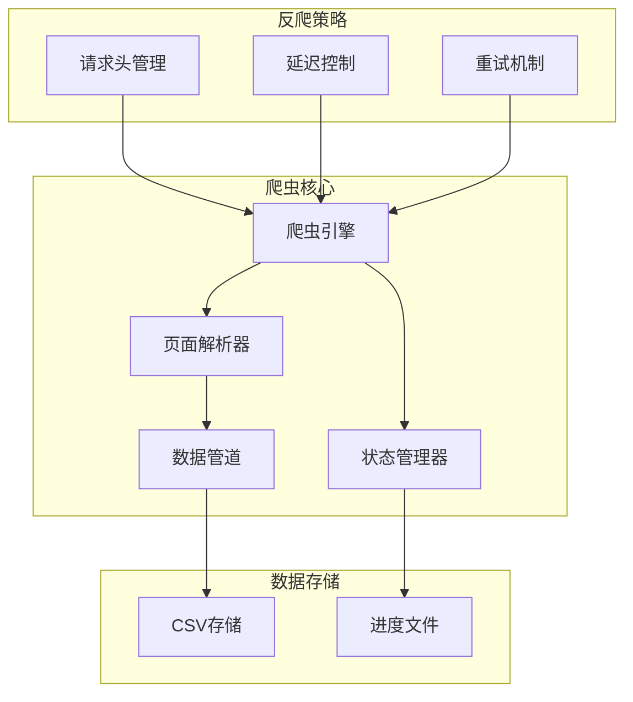

# 系统架构设计

## 整体架构


## 核心模块设计

### 1. 爬虫引擎 (Spider)
```python
class LianjiaSpider:
    def __init__(self):
        self.headers_manager = HeadersManager()
        self.state_manager = StateManager()
        self.parser = Parser()
        
    def crawl(self):
        # 从断点恢复或开始新爬取
        # 实现页面遍历逻辑
```

### 2. 状态管理 (StateManager)
```python
class StateManager:
    def __init__(self):
        self.progress_file = "progress.json"
        
    def save_progress(self, page, house_ids):
        # 保存当前进度
        
    def load_progress(self):
        # 加载上次进度
```

### 3. 页面解析 (Parser)
```python
class Parser:
    def parse_list_page(self, html):
        # 解析列表页
        
    def parse_detail_page(self, html):
        # 解析详情页
```

### 4. 数据管道 (Pipeline)
```python
class CSVPipeline:
    def __init__(self):
        self.file = "houses.csv"
        
    def process_item(self, item):
        # 处理并保存数据项
```

## 关键技术决策

### 1. 反爬虫策略
- User-Agent池轮换
- 随机延迟（2-5秒）
- 指数退避重试机制

### 2. 断点续爬实现
- JSON格式存储进度
- 记录页码和已爬房源ID
- 定期保存检查点

### 3. 异常处理策略
```python
class RetryStrategy:
    def __init__(self):
        self.max_retries = 3
        self.backoff_factor = 2
        
    def execute(self, func):
        # 实现重试逻辑
```

### 4. 数据存储格式
CSV字段设计：
```
房源ID,标题,总价,单价,小区名,区域,户型,面积,朝向,装修,电梯,楼层,建筑年代,抓取时间
```

## 设计模式应用

1. 单例模式
   - 状态管理器
   - CSV写入器

2. 策略模式
   - 请求头管理
   - 重试策略

3. 管道模式
   - 数据处理流程
   - 异常处理链

4. 观察者模式
   - 进度监控
   - 异常报警
